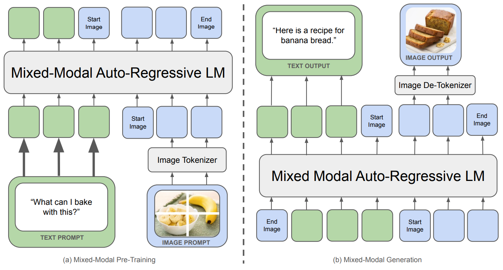
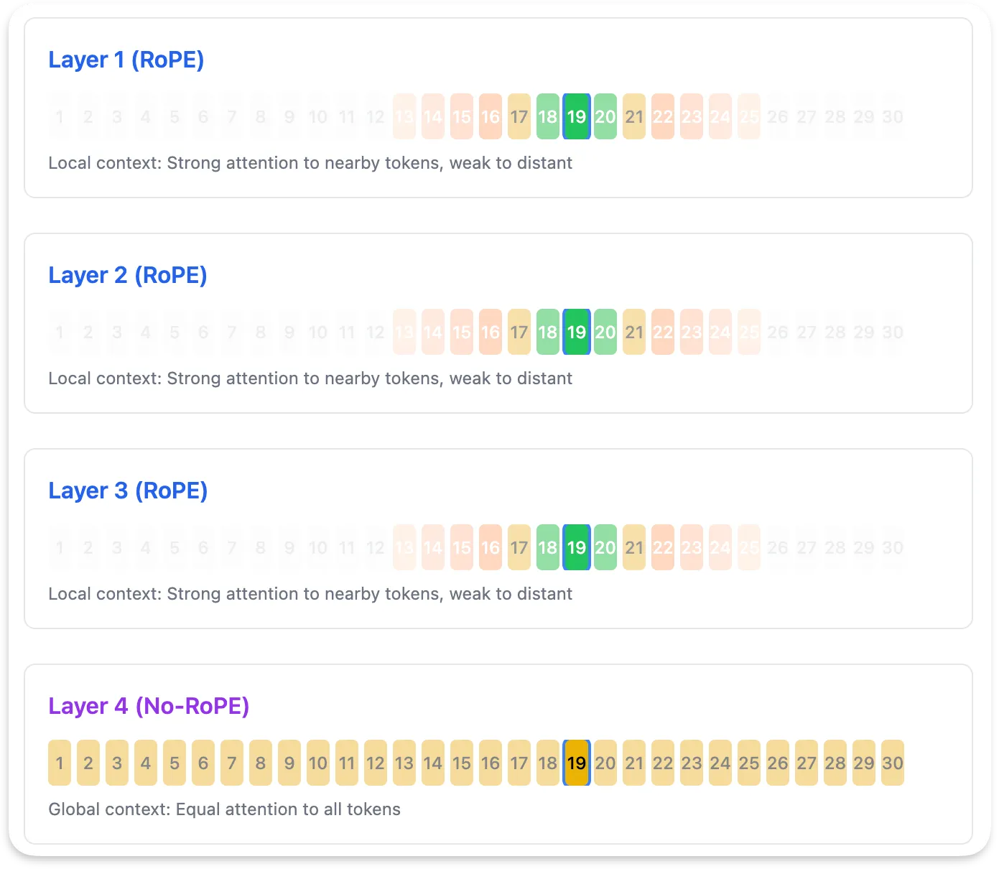
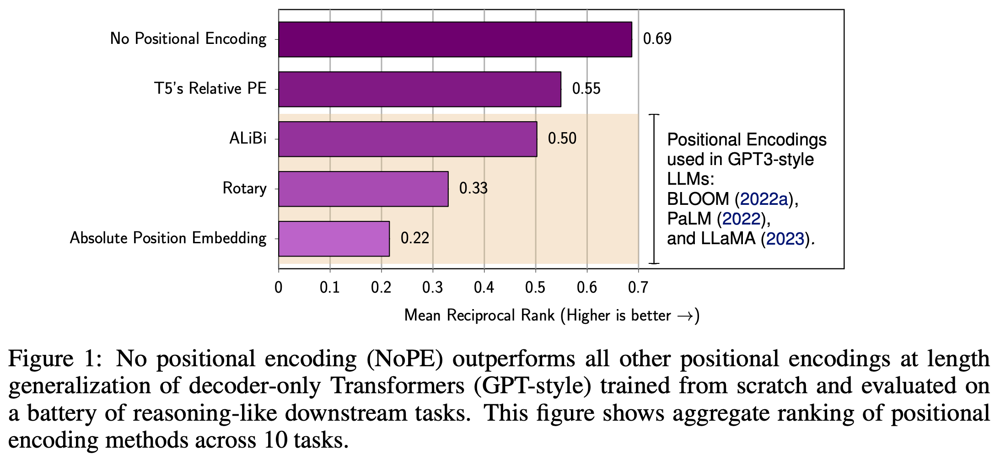
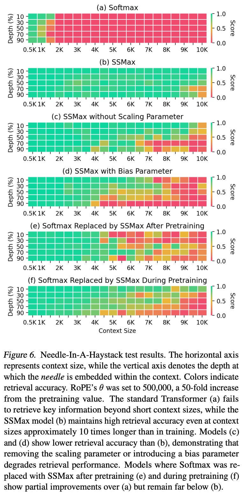
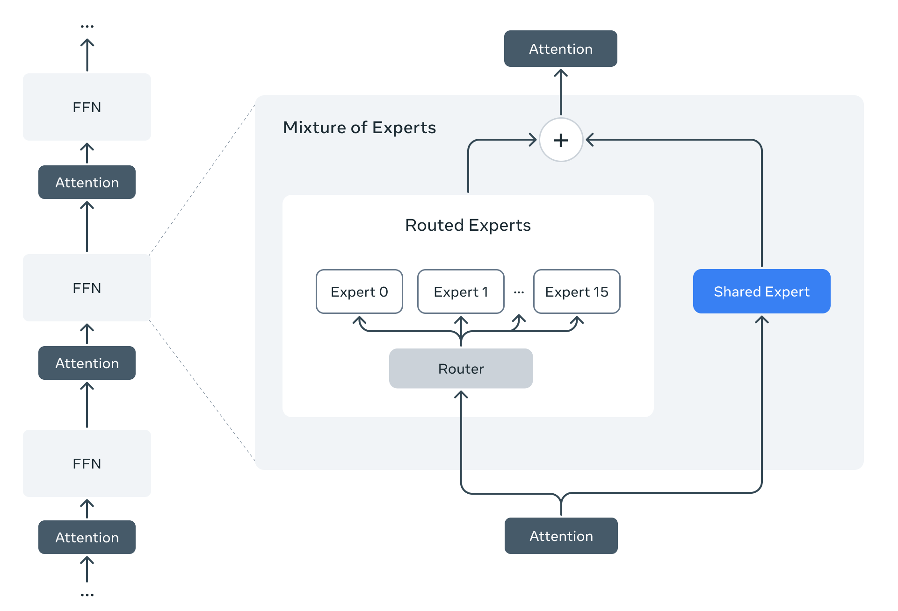
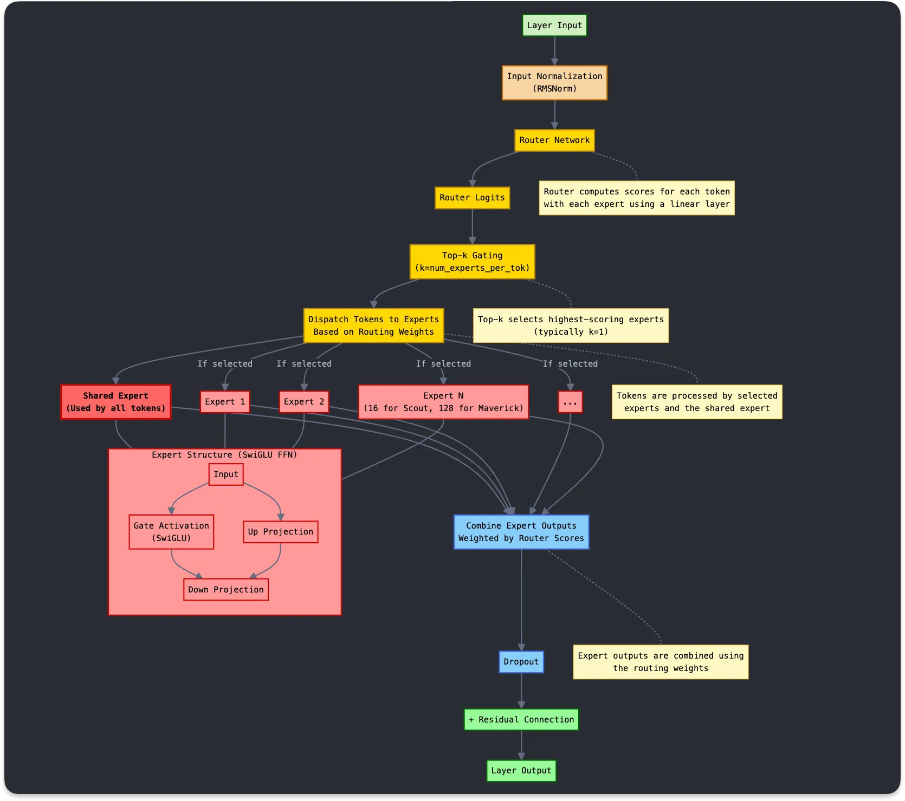
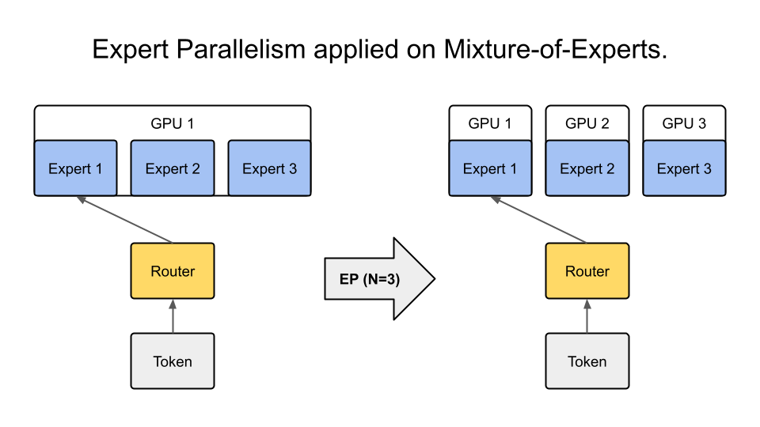
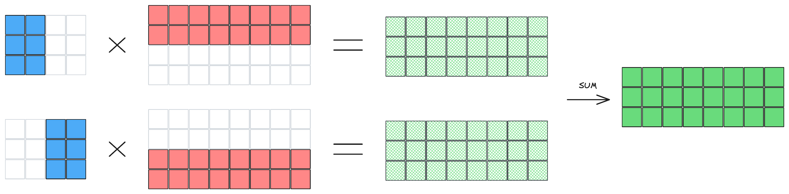

- https://medium.com/@mandeep0405/llama-4s-architecture-deconstructed-moe-irope-and-early-fusion-explained-e58eb9403067
- https://cameronrwolfe.substack.com/p/llama-4
- https://github.com/meta-llama/llama-models/tree/main/models/llama4

| Model | LLaMA | Llama 2 | Llama 3.1 | Llama 3.2 | Llama 4 |
| ----- | ----- | ------- | --------- | --------- | ------- |
| Released | 2023.02 | 2023.07 | 2024.07 | 2024.09 | 2025.04 |
| Model Size | 7B, 13B, 33B, 65B | 7B, 13B, 70B | 8B, 70B, 405B | 1B, 3B, 11B, 90B | Scout (17B/90B/16 experts), Maverick (17B/400B/128 experts), Behemoth (288B/12T/16 experts) |
| Normalization | RMSNorm | RMSNorm | RMSNorm | RMSNorm | RMSNorm |
| Positional Encoding | RoPE | RoPE | RoPE | RoPE | iRoPE (RoPE + NoPE) |
| Attention | MHA | MHA (7B, 13B), GQA (70B) | GQA | GQA | GQA |
| FFN | SwiGLU | SwiGLU | SwiGLU | SwiGLU | MoE |
|| Transformer 대비 LayerNorm을 RMSNorm으로 변경   Post-Norm 구조 대신 Pre-Norm 구조로 변경 | GQA 도입   KV 캐시 줄이기   그룹 단위로 KV를 분산시켜 다중 GPU 환경에서 효율적 || 11B, 90B는 Multimodal Model Llama 3.2 Vision Model은 Llama 4와 다르게 Image Encoder에서 출력한 Key, Value와 Decoder에서 출력한 Query를 기반으로 Cross Attention으로 동작 | Scout과 Maverick은 Behemoth로부터 co-distillation으로 학습 QK Norm 추가됨 iRoPE Temperature Tuning Early Fusion (Token Concatenation) |

# Native Multimodality with Early fusion
- Unified embedding: concatenates both image and text tokens at the input layer to form a single input sequence that is processed by the LLM

# Massive Context Window
## iRoPE (interleaved RoPE)
- 4개의 Transformer Block 중에서 3:1 비율로 RoPE와 NoPE가 섞여 있음
- RoPE는 토큰의 상대적 위치를 이해하고 NoPE는 위치를 무시하고 모든 토큰을 동등하게 바라봄 (Length generalization)

## Scalable Softmax
$$
\mathrm{Softmax}(x_i) = \frac{e^{x_i}}{\sum_{j=1}^{N} e^{x_j}}
$$

$$
\mathrm{Scalable\text{-}Softmax}(x_i) = \frac{N^{s x_i}}{\sum_{j=1}^{N} N^{s x_j}}
$$

- attention scores get smaller as the context length grows larger.
- By including the length of the input vector in Scalable-Softmax, we can balance the scale of the numerator and denominator, prevent long context attention scores from decaying and improve long context capabilities.

# MoE Architecture
- Shared Expert → 라우팅 결정과 무관하게 모든 토큰 처리. 기본적인 성능 보장
- Expert → Top-k Gating에 따라 특정 Expert를 고름. 모든 파라미터를 매번 활성화하지 않고도 여러 Expert 활용 가능

# Expert Parallelism vs Tensor Parllelism

- EP는 개념적으로 이해하기는 좋지만, GPU가 CPU처럼 branch에 유리한 구조가 아닐뿐더러 Token의 로드밸런싱이 불균형할 수 있음
- 이에 따라, Llama 4 MoE에서는 모든 Expert의 일부 Weight를 한 GPU에 나눠들고 있는 TP를 채택한듯